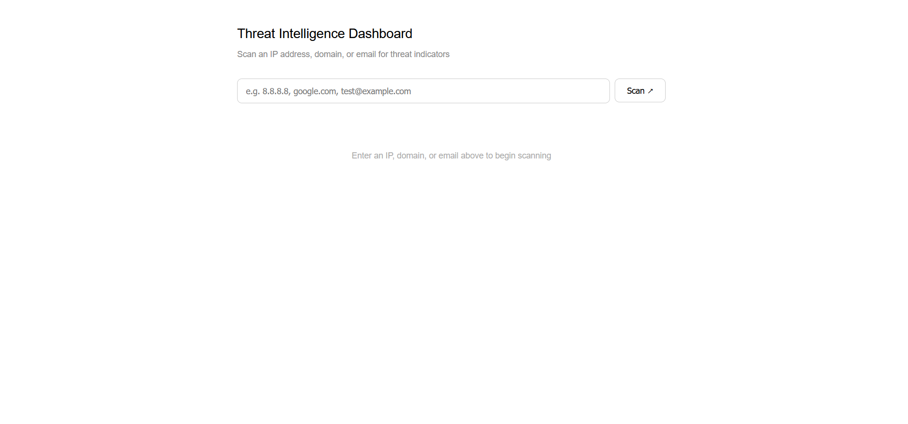
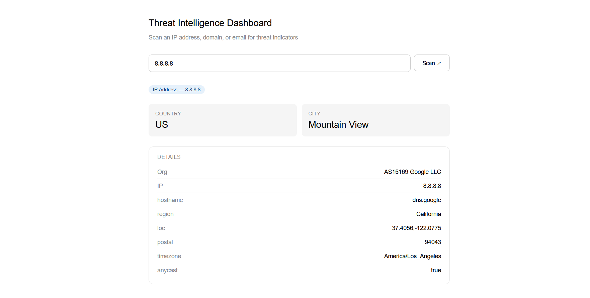

# Threat Intelligence Dashboard

A web app to scan IPs, domains, and emails for threat indicators using open-source intelligence APIs.




## Tech Stack

- **Frontend** — React
- **Backend** — FastAPI (Python)
- **APIs** — IPInfo, VirusTotal

---

## Features

- IP lookup — location, org, and raw metadata
- Domain scan — malicious, suspicious, harmless, undetected counts via VirusTotal
- Email breach check — risk score and breach list

---

## Run Locally

**Backend**
```bash
cd backend
pip install -r requirements.txt
uvicorn app.main:app --reload --port 8000
```

**Frontend**
```bash
cd frontend
npm install
npm start
```

Open `http://localhost:3000`

---

## Environment Variables

Create a `.env` file in `/backend`:

```
IPINFO_TOKEN=your_token_here
VIRUSTOTAL_API_KEY=your_key_here
```